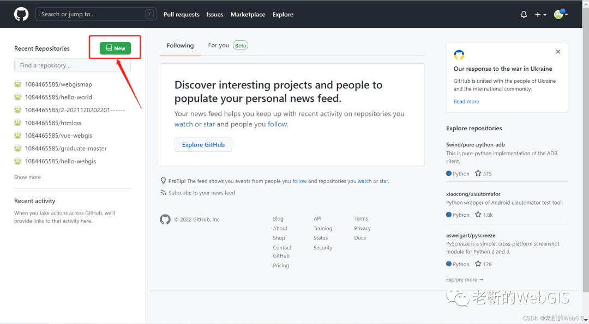
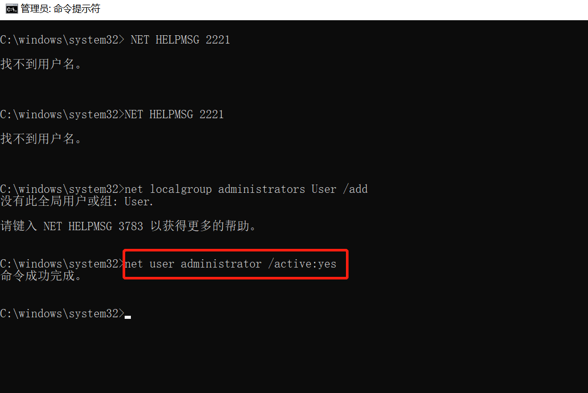
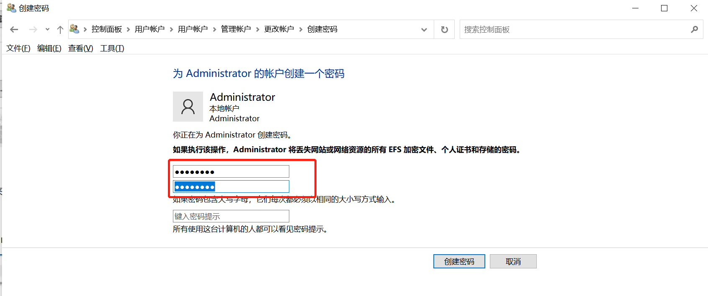

# hello-webgis
学习基于vue的ArcGIS API for JS

# 一、使用github工具管理WebGIS项目代码

## **1.1 使用 github 工具管理代码**

前言：本来我是没有用 github 将代码进行处理的，但是在做后面的项目时，因为一点点小的错误导致了一些列 bug，不能找到之前的代码版本了，所以警示了我们，一定要用 Github 或者 gitee 把我们的代码进行备份。

### git 基本使用

Git 是一个开源的分布式版本控制系统，用于敏捷高效地处理任何或小或大的项目

官网：GitHub ( https://github.com/ )

### 1 进入官网注册账号

官网：GitHub ( https://github.com/ )

### 2 新建一个仓库

点击左侧的 new

填写以下代码库的信息，点击创建，填写以下信息建议还是不要勾选增加描述文件的选项

就得到了你的一个代码库

### 3 将远程仓库拷贝到本地电脑

将 github 代码库的代码拷贝至自己的电脑，点击 code，复制这个地址


在项目本地目录，按住 Shitf+鼠标右键，打开 git bash here，在命令行界面输入


```
git clone 刚刚复制的链接
```


然后按回车，就看到把 github 仓库里面的东西都复制到你本地电脑上了


### 4 将本地代码提交到远程仓库

我们对刚刚拷贝下来的文件随便做一点修改，然后将其上传到远程仓库

同样的步骤，在项目本地目录，按住 Shitf+鼠标右键，打开 git bash here，在命令行界面输入,注意一定进入项目根目录


- 

```
cd hello-webgis
```


然后使用提交三部曲

> - git add . #添加文件到暂存区
> - git commit -m '描述信息' #将暂存区内容添加到本地仓库中
> - git push origin main #将本地分支版本上传到远程并合并


网络条件不好可能会推送失败，多试几次就可以了


# 二 、第一个基于vue的webgis项目

## 2.1  利用 vue-cli 创建第一个 vue 项目

### 1 创建一个项目 ( https://cli.vuejs.org/zh/guide/creating-a-project.html )

a. 创建一个文件夹：命名为 webgis


b. 在文件夹按 Shitf+鼠标右键，打开 PowerShell 窗口，运行以下命令来创建一个新项目：

```
vue create hello-webgis
```

c. 选择 vue 的 2 版本,等待安装


d. 文件目录

```
hello-webgis  -------->项目名称
	.git      -------->git工具
	node_modules ----->用来管理项目中使用的依赖
	public    -------->项目中使用到的资源，图片等？
		- index.html-->项目主页
	src       -------->用来书写vue的源代码【重点】
		- assets ----->用来存放静态资源【重点】
		- components ->用来书写vue组件【重点】
		- App.vue ---->项目中的根组件【重点】
		- main.js ---->项目中的主入口【重点】
	.gitignore    ---->git版本控制忽略软件
	babel.config.js
	package.json  ---->依赖的名称和版本号
	package-lock.json->详细的依赖版本
	README.md     ---->项目说明文件
```

为规范代码，需要在根目录加入以下文件：这部分的教程 CSDN 有个大佬写了，链接.prettierrc 代码格式化配置介绍 ( https://blog.csdn.net/qq_38734862/article/details/106769973 )

```
.vscode    --------->文件夹
    settings.json -->文件
```

在 settings.json 文件写入以下代码，设置在代码保存后自动格式化，每按下 ctrl+S 是代码会根据你配置的 prettierrc 规则进行格式化

```
{
    "editor.formatOnSave": true
}
```

在根目录加入以下文件

.prettierrc.js 是代码格式化的配置文件，代码的规范规则很多很繁琐，不可能每个都去手动修改，有时候一个页面能有上百个规范问题，那么这时候代码自动格式化就很有用了，最有名的就是 prettierrc 了。

```
.prettierrc.js   -->文件，
```

在.prettierrc.js 中写入以下代码：

```
module.exports = {
    semi: true, //句尾添加分号
    singleQuote: true, //使用单引号代替双引号
    trailingComma: 'all', //在对象或数组最后一个元素后面加逗号
    arrowParens: 'always', //箭头函数总是使用括号
    printWidth: 120, //超过最大值换行
    tabWidth: 2, //代码缩进
};
```

这样就在每次保存代码时自动将代码格式化了


### 2 运行 vue-cli 项目

在项目的根目录的 cmd 或 powelshell 或者在 vs code 的终端里面运行命令

```
npm run serve
```


```
注意一定要在项目的根目录里面输入命令!!!要不然会出现上面的错误
如果不在根目录，要cd hello-webgis命令，进入根目录
```


在根目录运行


### 3 得到你的第一个 vue 页面

恭喜你，成功得到了第一个 vue 开发的程序！


## 2.2 使用 Element UI 给页面添加布局

#### 1安装 Element UI 库

在命令行或者终端输入


```
npm install element-ui --save-dev
```


安装成功，在 package.json 的 devDependencies（开发环境）中看到 element-ui 已经被添加进去了

#### 2使用 element ui

(1 )在 main.js 引入 element ui

官网链接：组件 | Element ( https://element.eleme.cn/#/zh-CN/component/quickstart )


更改 main.js

```js
import Vue from 'vue'
import ElementUI from 'element-ui';
import 'element-ui/lib/theme-chalk/index.css';
import App from './App.vue'

Vue.config.productionTip = false
Vue.use(ElementUI);

new Vue({
  render: h => h(App),
}).$mount('#app')
```

#### 3 引入 element ui 的布局

官网链接：组件 | Element ( https://element.eleme.cn/#/zh-CN/component/container )选择下图所示的容器布局，点击”显示代码“按钮，将代码复制到 App.vue 中。

更改 App.vue

```js
<template>
  <div id="app">
    <el-container class="app-out-pannel">
      <el-header class="sys-header">WebGIS一张图项目系统</el-header>
      <el-container class="app-content-pannel">
        <el-aside class="sys-menu">左侧菜单栏</el-aside>
        <el-main>地图区域</el-main>
      </el-container>
    </el-container>
  </div>
</template>

<script>
export default {
  name: 'App',
  components: {},
};
</script>

<style>
html,
body,
#app {
  position: relative;
  width: 100%;
  height: 100%;
  margin: 0;
}
.app-out-pannel,
.app-content-pannel {
  height: 100%;
}
.sys-header {
  background-color: #303133;
  line-height: 60px;
  height: 60px;
  color: #fff;
  font-size: 600;
}
.sys-menu {
  background-color: #c0c4cc;
}
</style>

```

运行 npm run serve，得到我们的 WebGIS 一张图系统的界面


## 2.3 引入 GIS 功能

#### 1 安装 esri-loader

在命令行或终端输入：

```
npm install --save-dev esri-loader@3.5.0
注意，我是指定了版本安装的，大家也可以不指定版本
npm install --save-dev esri-loader
```


安装成功，可以看到 devDependencies 中多了一行

```
"esri-loader": "^3.5.0",
```

#### 2  新建 MapView.vue 组件

在 components 下新建 common 文件夹，在文件夹内新建 MapView.vue

注意命名要用驼峰命名，不能用 mapView.vue 或 Mapview.vue

在 MapView.vue 中写入：

```js
<template>
  <div id="mapview"></div>
</template>

<script>
export default {
  name: 'MapView',
  components: {},
};
</script>

<style>
#mapview {
  position: relative;
  width: 100%;
  height: 100%;
}
</style>
```

#### 3 在 App.vue 中引入 MapView.vue 组件

在 App.vue 中写入：

```js
<template>
  <div id="app">
    <el-container class="app-out-pannel">
      <el-header class="sys-header">WebGIS一张图项目系统</el-header>
      <el-container class="app-content-pannel">
        <el-aside class="sys-menu">左侧菜单栏</el-aside>
        <el-main class="sys-content">
          <MapView />
        </el-main>
      </el-container>
    </el-container>
  </div>
</template>

<script>
import MapView from './components/common/MapView.vue';
export default {
  name: 'App',
  components: {
    MapView,
  },
};
</script>

<style>
html,
body,
#app {
  position: relative;
  width: 100%;
  height: 100%;
  margin: 0;
}
.app-out-pannel,
.app-content-pannel {
  height: 100%;
}
.sys-header {
  background-color: #303133;
  line-height: 60px;
  height: 60px;
  color: #fff;
  font-size: 600;
}
.sys-menu {
  background-color: #c0c4cc;
}
.sys-content {
  padding: 5px;
}
</style>
```

#### 4 在 MapView.vue

在 MapView.vue 中写如下代码：

```js
<template>
  <div id="mapview"></div>
</template>

<script>
//引入loadModules
import { loadModules } from 'esri-loader';
const options = {
  //引入ArcGIS API
  url: 'https://js.arcgis.com/4.18/init.js',
  css: 'https://js.arcgis.com/4.18/esri/themes/light/main.css',
};
export default {
  name: 'MapView',
  components: {},
  //mounted 生命周期函数，在MapView组件创建完成之后就会执行里面的函数
  mounted: function () {
    this._createMapView();
  },
  methods: {
    //   创建地图视图
    //async await是成对出现的，意思是把那些模块加载完成之后才可以执行后面的代码
    async _createMapView() {
      const [Map, MapView] = await loadModules(['esri/Map', 'esri/views/MapView'], options);
      const map = new Map({
        basemap: 'osm',
      });
      const view = new MapView({
        container: 'mapview',
        center: [108, 32],
        map: map,
        zoom: 5,
      });
      console.log(view);
    },
  },
};
</script>

<style>
#mapview {
  position: relative;
  width: 100%;
  height: 100%;
}
</style>
```

#### 5 运行查看结果


# 三、 使用 Vue 路由构建多页面的 WebGIS 程序

本节描述：在第 2 节中，我们构建了一个 Vue 的前端程序，并使用 esri-loader 引入了 ArcGIS API for JS 的 Map、MapView 模块，构建了一个简单的 WebGIS 程序。但是我们的程序只有一个页面，不能实现页面跳转，因此在本节我们借助 vue router 来实现页面之间的跳转。

## 1 安装 vue router

1、通过以下命令安装路由，如下：

```
npm install vue-router --save-dev
建议像我一样直接指定版本
npm install vue-router@3.5.3 --save-dev
```


如果报错

```
export 'default' (imported as 'VueRouter') was not found in 'vue-router
```

就卸载当前 vue-cli，然后安装别的版本的


## 2 在页面增加导航按钮

a 打开 NavMenu 导航菜单链接组件 | Element ( https://element.eleme.cn/#/zh-CN/component/menu )


选择这个收起状态的导航菜单，复制代码，将 App.vue 更改为

```js
<template>
  <div id="app">
    <el-container class="app-out-pannel">
      <el-header class="sys-header">WebGIS一张图项目系统</el-header>
      <el-container class="app-content-pannel">
        <el-aside class="sys-menu">
          <el-menu
            default-active="1"
            class="el-menu-vertical-demo"
            @open="handleOpen"
            @close="handleClose"
            :collapse="true"
            background-color="#606266"
          >
            <el-menu-item index="1">
              <i class="el-icon-monitor"></i>
              <span slot="title">地图大屏</span>
            </el-menu-item>
            <el-menu-item index="2">
              <i class="el-icon-picture-outline"></i>
              <span slot="title">一张图</span>
            </el-menu-item>
            <el-menu-item index="3">
              <i class="el-icon-map-location"></i>
              <span slot="title">三维展示</span>
            </el-menu-item>
            <el-menu-item index="4">
              <i class="el-icon-setting"></i>
              <span slot="title">数据管理</span>
            </el-menu-item>
          </el-menu>
        </el-aside>

        <el-main class="sys-content">
          <router-view></router-view>
          <!-- <MapView /> -->
        </el-main>
      </el-container>
    </el-container>
  </div>
</template>

<script>
// import MapView from './components/common/MapView.vue';
export default {
  name: 'App',
  components: {
    // MapView,
  },
  methods: {
    handleOpen(key, keyPath) {
      console.log(key, keyPath);
    },
    handleClose(key, keyPath) {
      console.log(key, keyPath);
    },
  },
};
</script>

<style>
html,
body,
#app {
  position: relative;
  width: 100%;
  height: 100%;
  margin: 0;
}
.app-out-pannel,
.app-content-pannel {
  height: 100%;
}
.sys-header {
  background-color: #303133;
  line-height: 60px;
  height: 60px;
  color: #fff;
  font-size: 600;
}
.sys-menu {
  background-color: #606266;
  width: 60px !important;
  overflow: hidden;
}
.sys-content {
  padding: 5px;
}
</style>
```

效果图：

## 3 添加 DataVisual.vue 和 OneMap.vue 组件两个组件


编辑 DataVisual.vue

```js
<template>
  <div class="datavisual-page">首页大屏</div>
</template>

<script>
export default {
  name: 'DataVisual',
  components: {},
};
</script>

<style>
.datavisual-page {
  height: 100%;
  width: 100%;
  background-color: bisque;
}
</style>

```

编辑 OneMap.vue

```js
<template>
  <div class="onemap-page">WebGIS一张图</div>
</template>

<script>
export default {
  name: 'OneMap',
  components: {},
};
</script>

<style>
.onemap-page {
  height: 100%;
  width: 100%;
  background-color: cadetblue;
}
</style>

```

## 4 配置路由

在根目录新建 router 文件夹，里面新建 router.js 文件，写入下面的内容

```js
import Vue from 'vue';
import VueRouter from 'vue-router';
import DataVisval from './../pages/DataVisual.vue'
import OneMap from './../pages/OneMap.vue';

Vue.use(VueRouter);

export default new VueRouter({
    routes: [
        {
            path: '/',
            component: DataVisval
        },
        {
            path: '/onemap',
            component: OneMap
        },
    ],
    mode: 'history'
})
```

## 5 在 App.vue 中设置按钮点击后的路由跳转

 为 el-menu 定义了一个@select="handleMenuSelect"事件，根据 index 值，来判断要跳转到哪个地址。

```
this.$router.push() 可以通过修改url实现路由跳转。[this.$router.push() 的用法 - 简书 (jianshu.com)](https://www.jianshu.com/p/ec7ac6cbeeb1)
```

```js
<template>
  <div id="app">
    <el-container class="app-out-pannel">
      <el-header class="sys-header">WebGIS一张图项目系统</el-header>
      <el-container class="app-content-pannel">
        <el-aside class="sys-menu">
          <el-menu
            default-active="1"
            class="el-menu-vertical-demo"
            @select="handleMenuSelect"
            :collapse="true"
            background-color="#606266"
          >
            <el-menu-item index="1">
              <i class="el-icon-monitor"></i>
              <span slot="title">地图大屏</span>
            </el-menu-item>
            <el-menu-item index="2">
              <i class="el-icon-picture-outline"></i>
              <span slot="title">一张图</span>
            </el-menu-item>
            <el-menu-item index="3">
              <i class="el-icon-map-location"></i>
              <span slot="title">三维展示</span>
            </el-menu-item>
            <el-menu-item index="4">
              <i class="el-icon-setting"></i>
              <span slot="title">数据管理</span>
            </el-menu-item>
          </el-menu>
        </el-aside>

        <el-main class="sys-content">
          <router-view></router-view>
          <!-- <MapView /> -->
        </el-main>
      </el-container>
    </el-container>
  </div>
</template>

<script>
// import MapView from './components/common/MapView.vue';
export default {
  name: 'App',
  components: {
    // MapView,
  },
  methods: {
    handleMenuSelect(index) {
      console.log(index);
      if (index === '1') {
        //跳转到首页大屏
        this.$router.push('/');
      } else if (index === '2') {
        //跳转到一张图
        // this.$router.push() 可以通过修改url实现路由跳转
        this.$router.push('/onemap');
      }
    },
  },
};
</script>

<style>
    .....
</style>

```

实现的效果


## 6 在 OneMap 中引入 MapView.vue 组件

在一个组件中使用另外的组件，采用三步走战略：

```js
1 引入别的组件
import MapView from './../src/components/common/MapView.vue';
2 在components中注册组件
  components: {
    MapView,
  },
3 在div中实例化组件
  <div class="onemap-page">
    <MapView />
  </div>
```

编写 OneMap.vue

```js
<template>
  <div class="onemap-page">
    <MapView />
  </div>
</template>

<script>
import MapView from './../src/components/common/MapView.vue';
export default {
  name: 'OneMap',
  components: {
    MapView,
  },
};
</script>

<style>
.onemap-page {
  height: 100%;
  width: 100%;
  background-color: cadetblue;
}
</style>

```

此时，在 OneMap 中，我们就可以使用之前的 MapVIew 了，得到的效果：

# 3.2、使用VueX实现WebGIS组件间传值

本节描述：在 3.1 节中我们借助 vue router 来实现页面之间的跳转，本节我们将使用 VueX 来实现不同组件之间传递数值。

目的在于，将 MapView 中实例化的 view 挂载到 vuex 中，这样在别的组件中就可以直接把这个 view 拿来用，不用再次实例化了

## 1 在 main.js 中引入了 router

将 main.js 更改为

```js
import Vue from 'vue'
import ElementUI from 'element-ui';
import 'element-ui/lib/theme-chalk/index.css';
import App from './App.vue'
import router from './../router/router'

Vue.config.productionTip = false
Vue.use(ElementUI);

new Vue({
  router,
  render: h => h(App),
}).$mount('#app')
```

## 2 在 router.js 中加入对‘NavigationDuplicated: Avoided redundant navigation to current location: “/” ’的处理

参加大佬教程：https://blog.csdn.net/lzfengquan/article/details/113031064 ( https://blog.csdn.net/lzfengquan/article/details/113031064 )

```js
VueRouter.prototype.push = function push(location) {
    return originalPush.call(this, location).catch(err => err)
}
```

## 3 更改了 pages 的位置，将其更改到了 components 文件夹下，并更改了相应的引用


**/** 1 怎么开始你自己的学习 **/**

虽然我自己也很菜，但是我们要学的话，就不能只是看，必须要自己动手敲代码，不能说看一下就会了。所以还是自己动手操练起来吧，就算点了收藏，自己不实际敲一遍也还是不懂的。

## 4  获取我的项目代码

1、访问我的 GitHub 地址获取项目代码：

```
https://github.com/1084465585/laojin_webgis/commits/main
```


2、使用百度网盘获取项目代码：

```
2022_5_6_使用Vue路由构建多页面WebGIS程序
链接：https://pan.baidu.com/s/1cUywMe2DRnqlEi8W6xwHuA?pwd=pf24
提取码：pf24
```

## 5 在你的电脑上运行我的项目

在获取到我的项目代码之后，在 vs code 中输入以下命令：

```
第一步 安装我的项目的依赖
npm i
第二部 运行项目
npm run serve
```

## 6 使用 VueX 实现 WebGIS 组件间传值 

###  介绍一下vuex

我个人理解：Vuex是独立于vue的， 将各个组件中的数据存储到一个独立的地方，便于各个组件想用到数据时，就可以直接从vuex中去取值。

### **使用 vuex**

a 安装 vuex 在命令行输入

```
npm install vuex@3 --save-dev
```

b 在 src 文件夹下新建 store 文件夹，在里面新建 index.js 文件


在 index.js 中输入以下代码：

```js
import Vue from 'vue'
import Vuex from 'vuex'

Vue.use(Vuex)

const state = {
    _defaultMapView: '',       //默认地图view
}

const getters = {
    _getDefaultMapView() {
        return state._defaultMapView
    }
}
const mutations = {
    _setDefaultMapView(state, value) {
        state._defaultMapView = value
    }
}

const store = new Vuex.Store({
    state,
    getters,
    mutations
});

export default store;


```

在 main.js 中引入 store

```js

import Vue from 'vue'
import ElementUI from 'element-ui';
import 'element-ui/lib/theme-chalk/index.css';
import App from './App.vue'
import router from './../router/router'
import store from './store/index'

Vue.config.productionTip = false
Vue.use(ElementUI);

new Vue({
  router,
  store,
  render: h => h(App),
}).$mount('#app')
```

在 MapView 中的 view 实例化后面加入以下代码，将 MapView 中实例化的 view 传到 vuex 中去

```
this.$store.commit('_setDefaultMapView', view);
```

我们使用下面的命令来打印这个 view，发现打印成功，说明 view 已经被成功定义到 vuex 中去了

```
console.log(this.$store.getters._getDefaultMapView);
```


# 四、底图自定义和地图控件开发

## 底图自定义

本次开发的底图使用捷泰天域发布的底图服务，服务地址


```
http://map.geoq.cn/arcgis/rest/services/ChinaOnlineStreetPurplishBlue/MapServer
```

需要使用到的 API 是 Basemap 和 Tilelayer(因为捷泰的这个底图是切片服务，所以要用 Tilelayer)

```
Basemap官网链接
https://developers.arcgis.com/javascript/latest/api-reference/esri-Basemap.html
TileLayer官网链接
https://developers.arcgis.com/javascript/latest/api-reference/esri-layers-TileLayer.html
```


## 导入需要的 API 模块

**修改 MapView.vue**

1 在 MapView.vue 中导入 Basemap 和 TileLayer 模块：2 拷贝 Basemap 的示例代码并进行修改3 运行查看效果可以看到我们的底图已经变成了捷泰的底图了

此时的 MapView.vue 代码为

```js
<template>
  <div id="mapview"></div>
</template>

<script>
//引入loadModules
import { loadModules } from 'esri-loader';
const options = {
  //引入ArcGIS API
  url: 'https://js.arcgis.com/4.18/init.js',
  css: 'https://js.arcgis.com/4.18/esri/themes/light/main.css',
};
export default {
  name: 'MapView',
  components: {},
  //mounted 生命周期函数，在MapView组件创建完成之后就会执行里面的函数
  mounted: function () {
    this._createMapView();
  },
  methods: {
    //   创建地图视图
    //async await是成对出现的，意思是把那些模块加载完成之后才可以执行后面的代码
    async _createMapView() {
      const [Map, MapView, Basemap, TileLayer] = await loadModules(
        ['esri/Map', 'esri/views/MapView', 'esri/Basemap', 'esri/layers/TileLayer'],
        options,
      );
      let basemap = new Basemap({
        baseLayers: [
          new TileLayer({
            url: 'http://map.geoq.cn/arcgis/rest/services/ChinaOnlineStreetPurplishBlue/MapServer',
            title: 'Basemap',
          }),
        ],
        title: 'basemap',
        id: 'basemap',
      });
      const map = new Map({
        basemap: basemap,
      });
      const view = new MapView({
        container: 'mapview',
        center: [108, 32],
        map: map,
        zoom: 5,
      });
      this.$store.commit('_setDefaultMapView', view);
      console.log(this.$store.getters._getDefaultMapView);
    },
  },
};
</script>

<style>
#mapview {
  position: relative;
  width: 100%;
  height: 100%;
}
</style>
```

由于 basemaplayers 是一个数组，所以还可以根据自己的需要加载更多的底图，比如加载一个影像底图，再加载一个标注底图等。我这里就先不加了

## 地图控件开发 

**新建 MapTools.vue 文件**

在 components 下新建 MapTools.vue 文件，在里面写入

```js
<template>
  <div class="maptools-view">
    <span class="maptools-item">行政区划导航</span>
    <span class="maptools-item">距离测量</span>
    <span class="maptools-item">面积测量</span>
    <span class="maptools-item">清屏</span>
  </div>
</template>

<script>
export default {
  name: 'MapTools',
};
</script>

<style>
.maptools-view {
  position: absolute;
  padding: 0 15px;
  height: 30px;
  top: 20px;
  right: 15px;
  background-color: aliceblue;
}
.maptools-item {
  line-height: 30px;
  margin-left: 15px;
  color: black;
  cursor: pointer;
}
.maptools-item:first-child {
  margin-left: 0;
}
</style>
```

在 OneMap.vue 中引入 MapTools.vue这里有一个排版错误，需要在 App.vue 中加入以下代码

```vue
.app-content-pannel {
  position: relative;
}
```

运行查看结果

## **实例化底图切换控件 BasemapToggle**

***\*引入 BasemapToggle 模块\****

在 MapView.vue 中写入以下代码运行程序，点击右下角切换按钮，实现底图切换效果

## **实例化比例尺控件 ScaleBar**

arcgis api for js 自带的控件定位只有四个，top-left,top-right，bottom-left,bottom-right。不够灵活，因为在这里我们自定义一个 div 来放置我们的比例尺控件，这样就可以随意控制控件放置的位置了。定义一个 div，用于放置比例尺控件

设置 div 的位置


引入 ScaleBar 模块实例化 scaleBar，并指定它的 container 为上面定义的 div，并将比例尺添加到 view 中

得到比例尺控件


但是我们发现它的单位不是千米，可以在 scaleBar 的代码中加入以下设置，将单位改为 km

```
unit: 'metric',
```


效果如下


目前总的页面如下所示：

# 五、WebGIS目录树管理

本次的教程实现的是目录树的效果，GIF如下：

## 要实现的效果


### 添加目录树管理的开关按钮

在MapTools.vue中添加目录树管理的按钮，设置其点击的响应函数为@click="handleMapToolsItemClick，设置其id为maptree,在methods中添加对点击事件的响应函数。


按钮点击效果


### 使用vuex管理开关状态

在store的index.js中添加对maptree的控制。


在MapTools.vue中实现对maptree的控制和隐藏


打印maptree的状态：


### 新建MapTree.vue文件

在components中新建MapTree.vue文件，这个文件就是我们的目录树了。


快速生成vue的结构：


### 在OneMap中引入MapTree

还是采用三段式引入：


### 编写MapTree的代码

目录树我们使用的是element ui的Tree组件，用的是基础用法


在MapTree中写入以下代码：
这里使用了v-show指令来切换元素的显示状态，使用的参数是我们上一步定义在vuex中的_getDefaultMapTreeVisible，用它来拿到_defaultMapTreeVisible，也控制maptree控件的显隐的状态。

```vue
 <template>
  <div class="maptree-pannel" v-show="this.$store.getters._getDefaultMapTreeVisible"></div>
</template>

<script>
export default {
  name: 'MapTree',
};
</script>

<style>
.maptree-pannel {
  position: absolute;
  top: 90px;
  left: 80px;
  width: 200px;
  height: 300px;
  background-color: antiquewhite;
}
</style>
```

可以看到我们在按钮点击时，成功切换了目录树控件的显示和隐藏状态：


继续编写代码，加入element ui的Tree组件。将element ui的实例代码拷贝到我们的程序中，此时的MapTree组件为：

```vue
<<template>
  <div class="maptree-pannel" v-show="this.$store.getters._getDefaultMapTreeVisible">
    <el-tree :data="data" :props="defaultProps" @node-click="handleNodeClick"></el-tree>
  </div>
</template>

<script>
export default {
  name: 'MapTree',
  data() {
    return {
      data: [
        {
          label: '一级 1',
          children: [
            {
              label: '二级 1-1',
              children: [
                {
                  label: '三级 1-1-1',
                },
              ],
            },
          ],
        },
        {
          label: '一级 2',
          children: [
            {
              label: '二级 2-1',
              children: [
                {
                  label: '三级 2-1-1',
                },
              ],
            },
            {
              label: '二级 2-2',
              children: [
                {
                  label: '三级 2-2-1',
                },
              ],
            },
          ],
        },
      ],
      defaultProps: {
        children: 'children',
        label: 'label',
      },
    };
  },
  methods: {
    handleNodeClick(data) {
      console.log(data);
    },
  },
};
</script>

<style>
.maptree-pannel {
  position: absolute;
  top: 90px;
  left: 80px;
  width: 200px;
  height: 300px;
}
</style>

```

可以看到我们已经成功的在页面上加载了目录树：


### 挂载底图服务

```vue
  <template>
  <!-- v-show: 用于控制目录树控件的显示和隐藏 -->
  <div class="maptree-pannel" v-show="this.$store.getters._getDefaultMapTreeVisible">
    <el-tree :data="data" :props="defaultProps" @node-click="handleNodeClick"></el-tree>
  </div>
</template>

<script>
// 引入loadMondules
import { loadModules } from 'esri-loader'
const options = {
  // 引入ArcGIS API
  url: 'https://js.arcgis.com/4.18/init.js',
  css: 'https://js.arcgis.com/4.18/esri/themes/light/main.css',
}
export default {
  name: 'MapTree',
  data() {
    return {
      data: [
        {
          label: '捷泰天域服务',
          children: [
            {
              label: '英文底图',
              children: [
                {
                  label: '彩色英文底图',
                  layerid: 'layerid',
                  layerurl: 'http://map.geoq.cn/arcgis/rest/services/ChinaOnlineCommunityENG/MapServer',
                },
              ],
            },
            {
              label: '中文底图',
              children: [
                {
                  label: '暖色中文底图',
                  layerid: 'layerid',
                  layerurl: 'http://map.geoq.cn/arcgis/rest/services/ChinaOnlineStreetWarm/MapServer',
                },
              ],
            },
          ],
        },
        {
          label: '一级 2',
          children: [
            {
              label: '二级 2-1',
              children: [
                {
                  label: '三级 2-1-1',
                },
              ],
            },
          ],
        },
      ],
      defaultProps: {
        children: 'children',
        label: 'label',
      },
    }
  },
  methods: {
    async handleNodeClick(data) {
      if (data.layerurl) {
        // 删除已添加的图层
        const view = this.$store.getters._getDefaultMapView
        const resultLayer = view.map.findLayerById('layerid')
        // 如果结果图层已经添加,那就移除它,保证地图上只有一个目录树的图层
        if (resultLayer) view.map.remove(resultLayer)
        // 处理不同服务类型
        const [TileLayer, FeatureLayer] = await loadModules(
          ['esri/layers/TileLayer', 'esri/layers/FeatureLayer'],
          options
        )
        // 解析layerurl,拿到服务的类型,比如MapServer或者FeatureServer
        const c = data.layerurl.split('/')
        const serverType = c[c.length - 1]
        let layer = ''
        switch (serverType) {
          case 'MapServer':
            layer = new TileLayer({ url: data.layerurl, id: data.layerid })
            break
          case 'FeatureServer':
            layer = new FeatureLayer({ url: data.layerurl, id: data.layerid })
            break
          default:
            break
        }
        view.map.add(layer)
      }
    },
  },
}
</script>

<style>
.maptree-pannel {
  position: absolute;
  top: 90px;
  left: 80px;
  width: 200px;
  height: 300px;
  /* background-color: antiquewhite; */
}
</style>

```

### 代码解释：

```vue
v-show="this.$store.getters._getDefaultMapTreeVisible"
用于控制目录树控件的显示和隐藏

const resultLayer = view.map.findLayerById('layerid');
if (resultLayer) view.map.remove(resultLayer);
如果结果图层已经添加，那就移除它，保证地图上只有一个目录树的图层

const c = data.layerurl.split('/');
const serverType = c[c.length - 1];
解析layerurl，拿到服务的类型，比如MapServer或者FeatureServer
```

## 运行程序


# 六、 使用ArcGIS Server发布要素服务

前言：在前面的文章中，我在【完整的WebGIS教程】5WebGIS目录树管理中，使用了捷泰发布好的服务，在第六章，我们将要自己发布服务，进而在网页上使用我们的数据。

我发布服务时候参考的是大佬的教程，放上他的文章的网站

> https://blog.csdn.net/lovecarpenter/article/details/52462207

发布要素服务的步骤：

> 1、准备一个ArcSDE地理数据库（）
> 2、在ArcGIS创建一个数据库，并将其升级为地理数据库
> 3、将数据存储到SDE数据库中，并设置数据的属性
> 4、将SDE数据库注册到ArcGIS Serve，并发布服务

## 1 注册一个ArcSDE地理数据库

启动SQLServer


设置实例名称和账号密码（账号：sa,  密码：hh123456)


## 2 创建一个数据库，并将其升级为地理数据库

### 1 新建一个数据库，命名为test


### 2 使用ArcCatalog连接test数据库


点击确定，看到我们刚刚链接的数据库


### 3 将test数据库升级为地理数据库

右键，启动地理数据库


选择ArcGIS Server的授权文件


## 3 将数据存储到SDE数据库中，并设置数据的属性

### 1 将数据导入数据库中


选择实例数据：省、市、县的行政区划数据


导入成功：


可以看到我的数据库中已经有了刚刚选择的三个数据：


### 2 给要发布的要素注册版本

依次右键要发布的数据，点击管理，点击注册版本


## 4 将SDE数据库注册到ArcGIS Server，并发布服务

### 1 将SDE数据库注册到ArcGIS Server

打开ArcMap，双击添加数据库连接。

在
添加成功


将要发布服务的图层**从数据库**拖到地图界面中


### 2 发布服务

文件-共享为-服务：


发布服务：


首先需要安装arcgis server 10.2版本，参照：https://blog.csdn.net/qq_36213352/article/details/80646940

1.先下载ArcGIS server10.2的安装包

2.新建用户。打开以管理员身份打开cmd，输入如下命令:此命令意思是添加Administrator超级管理员

```
net user administrator /active:yes
```

输出命令成功完成即为成功



修改Administrator管理员密码，打开控制面板-用户账户，创建密码为：**hh123456**



安装arcgis server ,点击ESRI.exe，参考：https://blog.csdn.net/qq_36213352/article/details/80646940


创建一个新文件夹，名为test


点击：功能-Feature Access -分析


出现错误，双击此错误


按照截图的步骤一个一个点


再次点击分析，发现刚刚那个错误没了


点击发布：
如果报错：

> 服务器未做好发布准备,请检查服务器上的发布工具(系统/发布工具)是否已启动，那就是服务的问题，参考我另外的文章


成功发布服务：


## 5 查看服务

登录自己的ArcGIS server的网站，可以看到服务已经成功发布了

> http://localhost:6080/arcgis/manager/#


进入http://localhost:6080/arcgis/rest/services/test这个目录，可以看到发布的FeatureServer服务


也可以在online中预览：


## 6 测试数据获取方法

后语
到这里就完成了5WebGIS目录树管理开发,我的教程不收费，全部免费，如果觉得我讲的不错的话，就点个关注、收藏吧，这对我很重要！数据我会放在我的微信公众号上：“老靳的WebGIS”，(jin 四声)请在微信公众号上联系，发送“6.1”获取，得到数据和arcgis server 10.2许可文件哦！

# 6.2 使用@arcgis/core本地部署ArcGIS API for JS

**前言**

这前面的文章中，我使用的都是esri-loader的模式来引入ArcGIS API的，但是有时候我们需要在内网写程序，或者有时候网络条件不好（arcgis api的服务器是在国外），加载在线的api会很慢，所以我还是觉得把api给本地部署了会更好。

## **关于@arcgis/core**

ArcGIS API for JavaScript的导入方式经历了从“dojo”到“esri-loader”的变化，在4.18版本之后支持了ES Modules模式引入API。但是我一直没用过，我用的还是esri-loader的模式，就是先在代码中需要使用api的地方通过以下代码引入loadModules 和api的js和css文件:

```js
//引入loadModules
import { loadModules } from 'esri-loader';
const options = {
//引入ArcGIS API
    url: 'https://js.arcgis.com/4.18/init.js',
    css: 'https://js.arcgis.com/4.18/esri/themes/light/main.css',
};
```

然后通过`async await`的异步的方法在需要使用api的函数里里面实例化api的模块：

```js
//处理不同服务类型
asnyc funtction(){
    .......
    const [TileLayer, FeatureLayer] = await loadModules(
    ['esri/layers/TileLayer', 'esri/layers/FeatureLayer'],
    options,
    );
    .......
}
```

ES Modules模式引入API引入的方法是`@arcgis/core`模式，可以实现直接在组件顶部引入所需的API模块，例如：`import Map from '@arcgis/core/Map'; import MapView from '@arcgis/core/views/MapView';`的方式，然后在组件代码中使用`Map`和`MapView`模块了。

我选择`@arcgis/core`的原因有以下几条：

1. 相当于离线部署ArcGIS API for JS了，可以在内网使用。
2. ES6 Module是新一代javascript标准 ECMAScript 6 的新增特性，其语法和Python相似，比较简洁易用。另外，相比于其他模块加载器，ES6 Module是语法级别的实现，其静态代码分析相比于其他框架会更快更高效，方便做代码检测。

## 安装@arcgis/core

**1 安装@arcgis/core库**

```
npm install @arcgis/core@4.18.0 --save-dev
```

在`package.json`中可以查看`@arcgis/core`的版本。


**2 拷贝@arcgis/core/assets文件**

拷贝`@arcgis/core/assets`文件到项目的`public`文件夹中：

将`/node_modules/@arcgis/core/assets`文件夹复制到`public`下，这一步的目的是可以添加esri的css样式，这样就避免了必须使用网络链接对css文件的在线引用，在内网环境下也可以使用arcgis api for js的功能和css样式了。


原本的在线引用css


`/node_modules/@arcgis/core/assets`文件夹所在位置：


复制

拷贝至`public`下：


**3 在main.js中引入@arcgis/core/config和样式文件**

在main.js中配置seriConfig和css文件：
在main.js中添加代码：

```
import esriConfig from "@arcgis/core/config";
esriConfig.assetsPath = "./assets";
import '@arcgis/core/assets/esri/themes/light/main.css';
```

在main.js中配置seriConfig和css文件


此部分来源于官网：

https://developers.arcgis.com/javascript/latest/api-reference/esri-config.html#assetsPath

意为：在使用  NPM 包的本地构建时，覆盖用于加载 API 资产的 URL。这些资产包括styles, images, web workers, wasm and localization files。默认情况下，资产在运行时从 CDN 加载。

```js
assetsPath String
Since: ArcGIS API for JavaScript 4.18

Overrides the URL for loading the API assets when using local builds of the and NPM packages. The assets include styles, images, web workers, wasm and localization files. By default, assets are loaded from CDN at runtime.@arcgis/corearcgis-js-api
在使用 和 NPM 包的本地构建时，覆盖用于加载 API 资产的 URL。这些资产包括样式、图像、网络工作者、wasm 和本地化文件。默认情况下，资产在运行时从 CDN 加载。@arcgis/corearcgis-js-api
Default Value:"https://js.arcgis.com/[4.x]/@arcgis/core/assets"
See also:
Build with ES modules
Example:
import esriConfig from "@arcgis/core/config";
esriConfig.assetsPath = "./assets";
```

## 使用@arcgis/core

将组件中的esri-loader引入方式的代码删除，更改为ES Modules模式引入：
我们将`MapView.vue`和`MapTool.vue`中的esri-loader代码删除，换为ES Modules的代码即可。

MapView.vue


MapTree.vue

**获取代码：**

链接：https://pan.baidu.com/s/1xxoywOhrgZKKtPdfjNnaqw?pwd=dgbh

提取码：dgbh


参考文章：

> https://blog.csdn.net/tjx1997/article/details/119610327
> https://zhuanlan.zhihu.com/p/360733386

# 7.1 ArcGIS API for JS行政区划导航（上）

**前一节回顾**

在【完整的WebGIS教程】6.1 使用ArcGIS Server发布要素服务中，我们发布了三个要素服务，分别是省、市、区县的行政区划边界，其属性表中包含了Code（地区编码）和Name(名字)数据。在这一节，我们将用`QueryTask`对要素服务进行查询，并实现行政区划导航的功能。

**本节要实现的效果：**


**对要素服务的查询**

在server中可以看到发布的数据的属性，并且可以对数据进行SQL查询，得到数据的信息。


查询全部


查询的结果

## 行政区划导航功能模块搭建

**新建行政区划导航模块`XZQHComponent`**

在`components`中新建`XZQHComponent.vue`模块，并写入vue的基本结构：


**在index.js中定义控制模块显示和隐藏的变量**


**设置`XZQHComponent.vue`模块的样式**

定义此组件的div，并设置其样式，并使用`v-show`指令来控制改组件的显示和隐藏

```vue
<template>
  <div class="XZQHComponent-pannel" v-show="this.$store.getters._getDefaultXZQHComponentVisible"></div>
</template>

<script>
export default {};
</script>

<style>
.XZQHComponent-pannel {
  position: absolute;
  top: 90px;
  left: 80px;
  height: 500px;
  width: 300px;
  //给它一个背景色，方便查看
  background-color: antiquewhite;
}
</style>
```

**在Onemap中添加XZQHComponent组件**

同样的，还是采用三段式的引入方法，在Onemap组件中就使用到了我们刚刚创建的`XZQHComponent`组件了：


**在MapTool中添加对XZQHComponent组件的控制**


部分代码解释：


```vue
<template>
  <div class="maptools-view">
    <span class="maptools-item" @click="handleMapToolsItemClick" id="xzqh">行政区划导航</span>
  </div>
</template>

<script>
export default {
  name: 'MapTools',
  methods: {
    handleMapToolsItemClick(e) {
      console.log(e.target.id);
     switch (e.target.id) {
        case 'xzqh':
        //如果“行政区划导航”按钮被点击，就执行openXZQHComponentPannel函数，来切换组件的显示和隐藏状态
          this.openXZQHComponentPannel();
          break;
        case 'maptree':
          this.openMapTreePannel();
          break;
        case 'clear':
         break;
        default:
          break;
      }
    },

    openXZQHComponentPannel() {
    //使用getters方法获取存在vuex中的行政区划导航组件的显示状态
      let XZQHComponentPannel = this.$store.getters._getDefaultXZQHComponentVisible;
      //对显示状态进行取反，然后使用commit方法将取反后的显示状态传递给vuex
      this.$store.commit('_setDefaultXZQHComponentVisible', !XZQHComponentPannel);
    },
  },
};
</script>

<style>
省略
</style>
```

查看当前页面效果，可以看到，通过以上五个步骤，实现了对`XZQHComponent`组件的显隐控制。


## 行政区划导航功能代码编写

**编写头部js代码**

更改`<template>`代码为：

```vue
<template>
  <div class="XZQHComponent-pannel" v-show="this.$store.getters._getDefaultXZQHComponentVisible">
    <div class="XZQHComponent-header">
      <span>行政区划导航</span>
      <i class="el-icon-close" @click="closeXZQHPannel"></i>
    </div>
  </div>
</template>
```

注释：

```vue
<i class="el-icon-close"></i>
来自element-ui，是一个×按钮
```


**编写css代码，更改头部的样式**

在`<style>`中插入下面的代码：

```js
.XZQHComponent-header {
  width: 100%;
  height: 35px;
  border-bottom: 1px solid #e4e7ed;
  padding: 0 5px;
  box-sizing: border-box;
  display: flex;
  //* 均匀排列每个元素,首个元素放置于起点，末尾元素放置于终点 */
  justify-content: space-between;
}
.XZQHComponent-header > span {
  line-height: 35px;
  font-size: 16px;
  font-weight: 600;
}
.XZQHComponent-header > i {
  line-height: 35px;

  cursor: pointer;
}
```

注释：

> 1 设置span 和i的line-height和header 一样，这样就可以垂直居中了
> 2 `ustify-content: space-between;`均匀排列每个元素,首个元素放置于起点，末尾元素放置于终点
> 3 `cursor: pointer`设置鼠标移动到按钮上面的样式


**编写选择器js代码**

`element-ui`的官网链接：`https://element.eleme.cn/#/zh-CN/component/select`
我这里使用的是“可清空单选”的选择器，在`<template>`中加入代码：

在

```vue
 1 <div class="XZQH-select-pannel">
 2   <span class="XZQH-select-laber">省份：</span>
 3   <el-select
 4     //v-model:实现表单元素和数据的双向绑定
 5     v-model="provinceValue"
 6     // 选中值发生变化时触发的函数
 7     @change="handleProvinceValueChang"
 8     //size    输入框尺寸为最小的
 9     size="mini"
10     clearable
11     //placeholder    占位符，默认显示的文字
12     placeholder="请选择省份"
13   >
14     //v-model的值为当前被选中的el-option的 value 属性值
15     <el-option v-for="item in provinceOptions" :key="item.value" :label="item.label" :value="item.value">
16     </el-option>
17   </el-select>
18 </div>
```

注释:


效果：


**编写css代码，更改选择器的样式**

在`<style>`中插入下面的代码：

```js
 1.XZQH-select-pannel {
 2    width: 100%;
 3    height: 30px;
 4    padding: 0 5px;
 5    box-sizing: border-box;
 6    margin: 5px 0;
 7}
 8.XZQH-select-label {
 9    font-size: 13px;
10}
```

效果：


**编写选择器的js代码：**

```vue
 1<script>
 2//引入需要使用到的ArcGIS API模块
 3import QueryTask from '@arcgis/core/tasks/QueryTask';
 4import Query from '@arcgis/core/tasks/support/Query';
 5export default {
 6  name: 'XZQHComponent',
 7  data() {
 8    return {
 9      provinceOptions: [],
10      provinceValue: '',
11    };
12  },
13  mounted: function () {
14    this.getProvinceData();
15  },
16  methods: {
17    //获取行政区划中的省份数据
18    getProvinceData() {
19      const queryTask = new QueryTask({
20        //之前发布的省份的FeatureLayer服务的链接
21        url: 'http://localhost:6080/arcgis/rest/services/test/MyMapService/FeatureServer/0',
22      });
23      let query = new Query();
24      query.returnGeometry = true; //返回几何信息
25      query.outFields = ['*']; //返回所有属性
26      query.where = '1=1'; //SQL查询语句，范围所有查询到的值
27      //Promise then 链式调用
28      queryTask.execute(query).then((results) => {
29        console.log(results);
30        let currentData = [];
31        if (results.features.length > 0) {
32          results.features.map((item) => {
33            currentData.push({
34              value: item.attributes.Code,
35              label: item.attributes.Name,
36            });
37          });
38          this.provinceOptions = currentData;
39        } else {
40          this.$message({
41            message: '暂时没有省份数据',
42            type: 'warning',
43          });
44        }
45      });
46    },
47    closeXZQHPannel() {
48      let XZQHComponentPannel = this.$store.getters._getDefaultXZQHComponentVisible;
49      this.$store.commit('_setDefaultXZQHComponentVisible', !XZQHComponentPannel);
50    },
51  },
52};
53</script>
```

注释：

**QueryTask**

> https://developers.arcgis.com/javascript/latest/api-reference/esri-tasks-QueryTask.html
>
> 
>
> 在图层上执行不同的查询操作，最常使用的方法是queryTask.execute()

**queryTask.execute(query).then((results) => {}**

> 对url中指定的图层进行查询，返回的是一个`Promise<FeatureSet>`对象
> https://developers.arcgis.com/javascript/latest/api-reference/esri-tasks-QueryTask.html#execute

**promises**

> promises是ES6的语法，是处理异步函数的
> https://developers.arcgis.com/javascript/latest/programming-patterns/#promises
>
> 
>
> ### queryTask.execute(query).then((results) => {}得到的results
>
> 打印`queryTask.execute(query).then((results) => {}`得到的`results`，是一个features的数组，它的属性在`attributes`中，因此可以用`item.attributes.Code`拿到它的属性信息
>
> 

**此时的页面**

此时，已经通过`QueryTask`查询获得了之前发布的省级要素的属性，将属性信息中的`Name`显示到了选择器的`v-model`中，于是就能看到省份名称了。


**回顾：**

- 首先，我们编写了一个行政区划导航的vue模块，并设置了它的显示和隐藏
- 然后，我们编写了行政区划导航的功能页面，编写了页面的头部和选择器部分
- 最后，我们在选择器中使用了QueryTask查询，从我们发布的省份数据的FeaureServer中获取到了属性信息，也就是省份的名称，并将其展示在了选择器中

**获得代码**

```
链接：https://pan.baidu.com/s/16An-wg3gSS0bIZT_aZErtQ?pwd=y316 
提取码：y316 
--来自百度网盘超级会员V3的分享
```


# 7.2 ArcGIS API for JS行政区划导航（下）

**前一节回顾**

在【完整的WebGIS教程】7.1 ArcGIS API for JS行政区划导航（上）中，我们编写了对省份的要素服务的查询功能，在本节，我们将实现对市、区县的查询和定位。

**本节要实现的效果：**


**编写内容框的代码**

```vue
 1<div class="XZQH-content-pannel">
 2 <tbody>
 3    <tr v-for="item in cityAndCountyOptions" :key="item.label">
 4      <td style="min-width: 50px">
 5        <span class="city-item" :value="item.value" @click="handleItemClick(item.value, 'city')">
 6          {{ item.label }}
 7        </span>
 8      </td>
 9      <td>
10        <span
11          class="county-item"
12          v-for="item2 in item.children"
13          :key="item2.attributes.Name"
14          :value="item2.attributes.Code"
15          @click="handleItemClick(item2.attributes.Code, 'county')"
16          >{{ item2.attributes.Name }}</span
17        >
18      </td>
19    </tr>
20  </tbody>
21</div>
```

## **编写内容框的css样式代码**

```js
 1.XZQH-content-pannel {
 2  width: 100%;
 3  height: 425px;
 4  overflow: auto;
 5  padding: 0 5px;
 6  box-sizing: border-box;
 7}
 8.city-item {
 9  font-size: 12px;
10  color: #5f6477;
11  font-weight: 600;
12  cursor: pointer;
13}
14.county-item {
15  font-size: 12px;
16  color: #999;
17  margin: 0 10px 5px 0;
18  cursor: pointer;
19}
20.county-item:hover {
21  color: #409eff;
22}
23tr {
24  display: block; /*将tr设置为块体元素*/
25  margin-bottom: 15px; /*设置tr间距为15px*/
26}
```

## **编写行政区划名称查询的代码**

```js
 1//行政区划中的省份变化的事件
 2handleProvinceValueChange(value) {
 3  console.log(value);
 4  this.getCityAndCountyData(value);
 5},
 6async getCityAndCountyData(value) {
 7  //这里要写成异步函数
 8  const _self = self;
 9  console.log(value);
10  const provinceCode = value.toString().substring(0, 2);
11  const queryTask = new QueryTask({
12    url: 'http://localhost:6080/arcgis/rest/services/test/MyMapService/FeatureServer/2',
13  });
14  let query = new Query();
15  query.returnGeometry = false;
16  query.outFields = ['*'];
17  //Code like '13%'
18  query.where = "Code like '" + provinceCode + "%'";
19  console.log('SQL语句：' + "Code like '" + provinceCode + "%'");
20  let results = await queryTask.execute(query); //异步，返回一个Promise对象
21  console.log('queryTask.execute(query):results' + results); //queryTask.execute(query):results[object Promise]
22  let currentCityData = [];
23  console.log(results.features);
24  if (results.features.length > 0) {
25    results.features.map((item) => {
26      currentCityData.push({
27        value: item.attributes.Code,
28        label: item.attributes.Name,
29      });
30    });
31    //循环遍历 results.features，拿到每个市对应的区县数据
32    Promise.all(
33      currentCityData.map(async (item2) => {
34        const cityCode = item2.value.toString().substring(0, 4);
35        const queryTask2 = new QueryTask({
36          url: 'http://localhost:6080/arcgis/rest/services/test/MyMapService/FeatureServer/1',
37        });
38        let query2 = new Query();
39        query2.returnGeometry = false;
40        query2.outFields = ['*'];
41        query2.where = "Code like '" + cityCode + "%'";
42
43        const result2 = await queryTask2.execute(query2);
44        item2.children = result2.features;
45        return item2;
46      }),
47    ).then((res) => {
48      console.log(res);
49      this.cityAndCountyOptions = res;
50    });
51  } else {
52    _self.$message({
53      message: '暂时没有市级数据',
54      type: 'warning',
55    });
56  }
57},
```

**代码解释：**

**Promise.all()**

> https://developer.mozilla.org/zh-CN/docs/Web/JavaScript/Reference/Global_Objects/Promise/all

Promise.all在MDN上面的解释


​																						Promise.all在MDN上面的解释


在我看来，Promise的all方法提供了并行执行异步操作的能力，并且在所有异步操作执行完后才执行回调。此方法在集合多个 promise 的返回结果时很有用。


## **编写点击跳转并高亮显示的代码**

```js
 1//点击跳转并高亮
 2    async handleItemClick(val, type) {
 3      console.log('type');
 4
 5      //type判断点击的是市还是区县
 6      let serverUrl = '';
 7      let code = '';
 8      const view = this.$store.getters._getDefaultMapView; //通过vuex获得view
 9      console.log(type);
10      if (type === 'city') {
11        code = val.toString().substring(0, 4);
12        console.log(code);
13        serverUrl = 'http://localhost:6080/arcgis/rest/services/test/MyMapService/FeatureServer/2';
14      } else if (type === 'county') {
15        code = val.toString().substring(0, 6);
16        serverUrl = 'http://localhost:6080/arcgis/rest/services/test/MyMapService/FeatureServer/1';
17      }
18      const queryTask = new QueryTask({
19        url: serverUrl,
20      });
21      let query = new Query();
22      query.returnGeometry = true;
23      query.outFields = ['*'];
24      query.where = "Code like'" + code + "%'";
25
26      let results = await queryTask.execute(query);
27      console.log(results);
28      //符号化查询到的结果，并定位至结果
29      const featuresResult = results.features[0];
30      console.log(featuresResult);
31      if (graphic) {
32        view.graphics.remove(graphic);
33      }
34      const fillSymbol = {
35        type: 'simple-fill',
36        color: [188, 240, 234, 0.1],
37        outline: {
38          color: '#00FFFF',
39          width: 2,
40        },
41      };
42      graphic = new Graphic({
43        geometry: featuresResult.geometry,
44        symbol: fillSymbol,
45      });
46      view.graphics.add(graphic);
47      console.log(graphic.geometry.extent);
48      console.log(view.extent);
49
50      view.goTo(
51        {
52          center: [graphic.geometry.extent.center.longitude, graphic.geometry.extent.center.latitude],
53          zoom: 11,
54        },
55        {
56          duration: 1000,
57        },
58      );
59      // view.extent = graphic.geometry.extent.expand(1.6);
60    },
```

**代码解释**

```js
1view.goTo(
2 {
3    center: [graphic.geometry.extent.center.longitude, graphic.geometry.extent.center.latitude],
4    zoom: 11,
5  },
6  {
7    duration: 1000,
8  },
9);
```

view.goto里面的duration参数可以使得跳转更加丝滑。


代码：

链接：https://pan.baidu.com/s/1ucPsJdfb76-s0yBJVt-RKw?pwd=mvx4

提取码：mvx4


